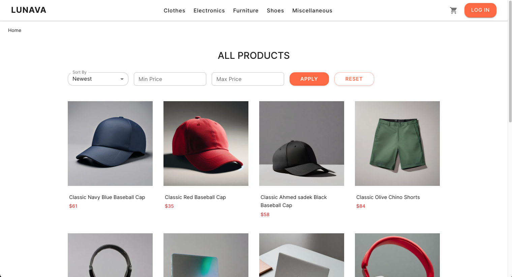

# Lunava — Advanced React E-Commerce App

Welcome to **Lunava**, a modern, responsive, and dynamic e-commerce web application built with **React**, **Redux Toolkit**, **React Query**, and **Auth0**. It simulates an end-to-end shopping experience using the [Platzi Fake Store API](https://fakeapi.platzi.com/en).



---

## Features

- **Authentication** with Auth0
- **Cart Management** using Redux Toolkit
- **Data Fetching** via React Query
- **Category Filtering** (dynamic via API)
- **Per-user cart persistence** using `sessionStorage`
- **Quantity adjustments**, subtotal & total calculations
- **Checkout flow** with confirmation and feedback
- Responsive design with Material UI

---

## Tech Stack

- **React 18**
- **Redux Toolkit**
- **React Query**
- **Material UI**
- **React Router**
- **Auth0**
- **React Toastify**
- **Platzi Fake Store API**

---

## Getting Started

### Prerequisites

- Node.js v16+ and npm
- Auth0 account (for authentication)

### Installation

```bash
git clone https://github.com/Jae-YS/Lunava
cd lunava-ecommerce
npm install
```

### Set up Auth0

Create a `.env` file at the root and add:

```env
VITE_AUTH0_DOMAIN=your-auth0-domain
VITE_AUTH0_CLIENT_ID=your-auth0-client-id
```

---

### ▶ Run the App

```bash
npm run dev
```

Then visit: [http://localhost:5173](http://localhost:5173)

---

## Usage

1. **Login / Register** via Auth0
2. Browse all products or filter by category
3. Add items to your cart from the product list or detail view
4. Update item quantities directly in the cart
5. Checkout via confirmation dialog
6. Cart state is saved per user in `sessionStorage`

---

## Project Structure

```bash
src/
├── components/         # UI components (Navbar, CartDrawer, etc.)
├── context/            # UI & Auth context (e.g. useUIContext)
├── features/           # Redux slices (cart)
├── hooks/              # React Query hooks
├── pages/              # Route-based components (Home, Cart, ProductDetail)
├── utils/              # sessionStorage utilities
├── constants/          # Static category data
```

---

## Notes

- All cart logic is scoped per user via `sessionStorage["cart:<email>"]`
- Platzi Fake Store API is used only for products/categories; no real transactions occur
- This project is educational and not production-ready
